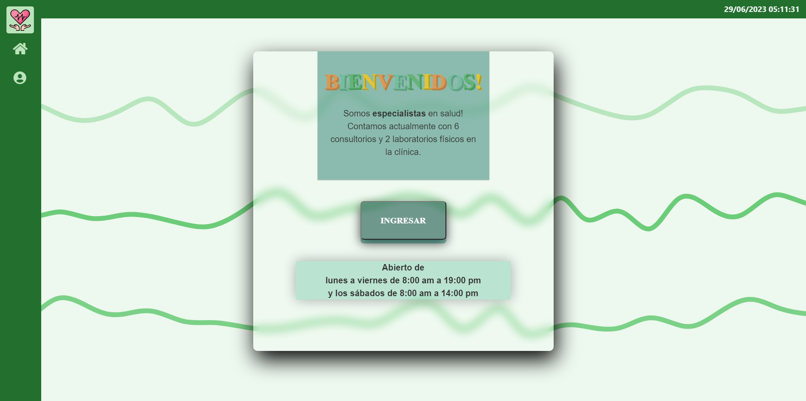
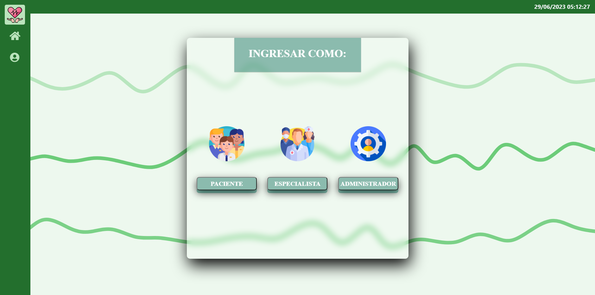
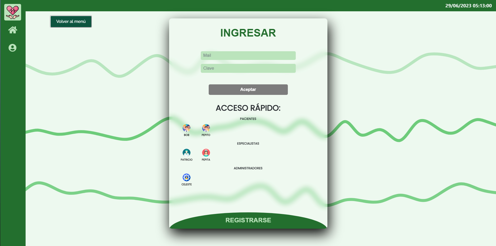

# TP 2 Clínica Online - CELESTE CISTERNAS

### Vista del inicio y barra de navegación principal:

# INGRESO A LA PÁGINA

### Se selecciona que usuario ingresara para iniciar sesión:

### Si el usuario no se encuentra en la base de datos se podrá registrar como paciente o especialista:

# RECORRIDO DEL PACIENTE

### Al ingresar como paciente se verá la página de bienvenida con los atajos para las siguientes:

## Mi Perfil Paciente

### Los pacientes podrán ver sus datos personales e incluso los historiales clínicos que le suban sus especialistas.

## Mis Turnos Paciente

### Los pacientes podrán ver su historial de turnos y cancelarlos.

## Solicitar Turnos Paciente

### Los pacientes podrán solicitar turno eligiendo su especialista y luego su especialidad:

# RECORRIDO DEL ESPECIALISTA

### Al ingresar como especialista se verá la página de bienvenida con los atajos para las siguientes:

## Mi Perfil Especialista

### Los especialistas podrán ver sus datos personales y generar sus horarios dependendiendo de su especialidad.

## Mis Turnos Especialista

### Los especialistas podrán ver su historial de turnos, rechazar, cancelar y aceptar el turno y una vez finalizado cargar el historial clínico del paciente atendido.

## Sección Pacientes Especialista

### Los especialistas podrán ver a todos sus pacientes y al hacer click en su información se abrirá una ventana con los datos de las últimas 3 consultas.

# RECORRIDO DEL ADMINISTRADOR

### Al ingresar como administrador se verá la página de bienvenida con los atajos para las siguientes:

## Mi Perfil Administrador

### Los administradores podrán ver sus datos personales.

## Solicitar Turnos Administrador

### Los administradores podrán solicitar turnos para los pacientes y eligir sus especialista y especialidades al igual que los pacientes.

## Gestión Turnos Administrador

### Los administradores podrán ver el historial de turnos de todos los pacientes y cancelarlos.

## Sección Usuarios Administrador

### Los administradores podrán ver a todos los usuarios, en el caso de los pacientes podrán ver sus historiales clínicos y descargarlos en formato EXCEL y a los especialistas se les podrá habilitar o deshabilitar el ingreso al sistema. Además los administradores pueden registrar pacientes, especialistas y a otros administradores:

## Informes Administrador
### En esta sección se proporcionarán gráficos y estadísticas sobre los turnos.

Todos los informes tendrán la opción de ser descargados en formato PDF o Excel y son los siguientes:

- Log de ingresos al sistema. Indicando el usuario, día y horario en que ingresó al sistema:

- Cantidad de turnos por especialidad:

- Cantidad de turnos por día:

- Cantidad de turnos solicitados por médico en un lapso de tiempo:

- Cantidad de turnos finalizados por médico en un lapso de tiempo:

